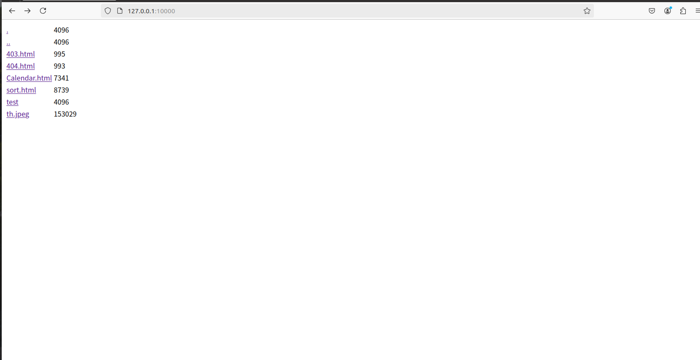
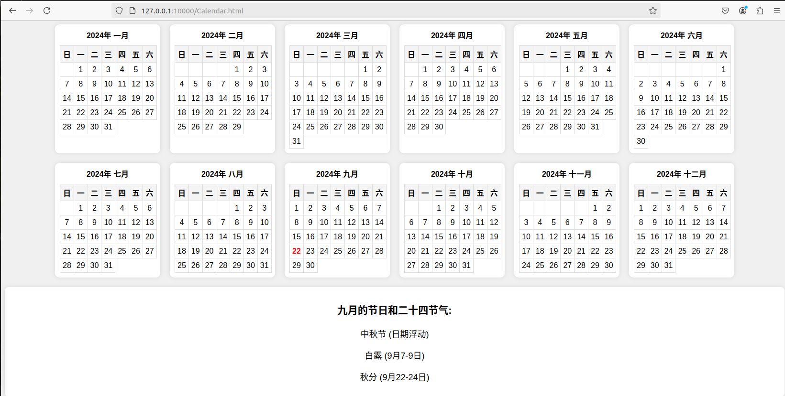

------

## 这是一个基于Reactor模型的HTTPServer

```shell
\#请在main.cc文件下面，修改你的文件路径
\#在做测试时，请在文件路径中添加一些文件内容
#请注意你的cmake版本，以及c++版本
.
cd ReactorHttp
cmake -B build
cmake --build build
.
# 启动服务器
./build/reactorhttp

```

在浏览器输入任意的地址加上main.cc文件中设定的端口号, 以下是测试效果

------





```shell
# 可以修改CMakeLists.txt，使得main.cc与其他的内容分开
# 在本地生成一个静态lib，然后加入这个静态库头文件，重新编译main.cc文件，具体步骤如下：
# 将当前目录下的CMakeLists.txt和autobuild.sh复制到ReactorHttp目录下，覆盖之前的
# CMakeLists.txt文件，然后：
sudo ./autobuild.sh
# 执行上面指令，得到静态链接库libreactorhttp.so文件
# 然后重新修改文件main.cc，即将头文件改成如下模式：
#include <reactorhttp/HttpServer>
#然后编译文件 
g++ -std=c++14 mian.cc -o main
./main
```

